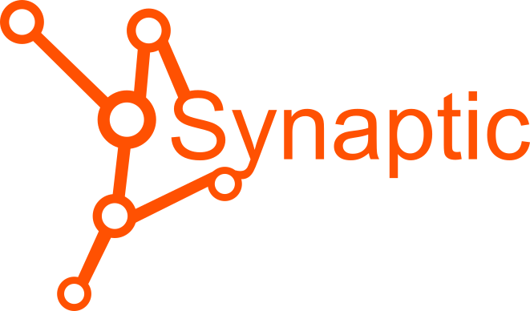

<p align="center">
	<br>
    
	<br>
 <p align="center">
 
 ---
dependency-less neural network library 
[Synaptic.js](https://github.com/cazala/synaptic) ported to [Deno](https://deno.land/)

## Usage:

```ts

import { Layer, Network, Trainer } from "./mod.ts";

class Perceptron extends Network {
  public constructor(input: any, hidden: any, output: any) {
    super();
    let inputLayer = new Layer(input);
    let hiddenLayer = new Layer(hidden);
    let outputLayer = new Layer(output);

    inputLayer.project(hiddenLayer);
    hiddenLayer.project(outputLayer);

    this.set({
      input: inputLayer,
      hidden: [hiddenLayer],
      output: outputLayer,
    });
  }
}


let myPerceptron = new Perceptron(2,3,1);

let myTrainer = new Trainer(myPerceptron);

myTrainer.XOR();

myPerceptron.activate([0,0]); // 0.0268581547421616
myPerceptron.activate([1,0]); // 0.9829673642853368
myPerceptron.activate([0,1]); // 0.9831714267395621
myPerceptron.activate([1,1]); // 0.02128894618097928
```

```
deno run -A ./test.ts
```